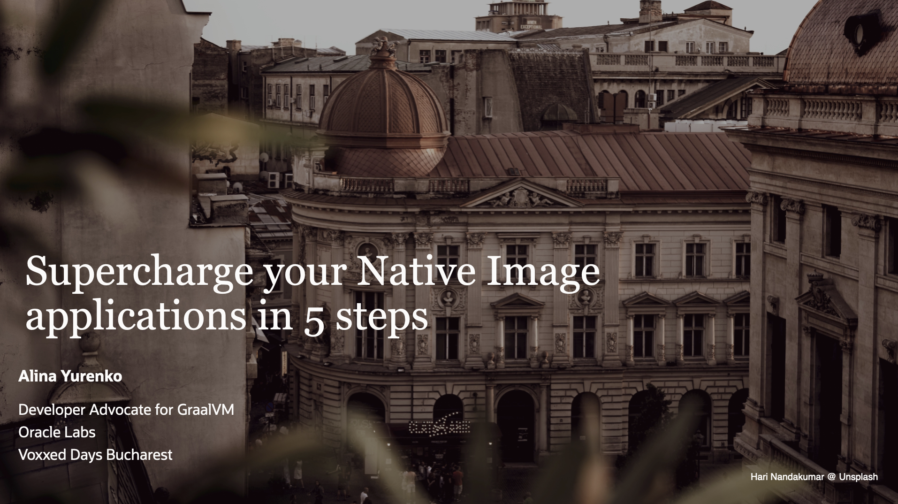

---
hide:
  - toc
  - navigation
---

# Supercharge your Native Image applications in 5 steps

Thank you for coming to this talk! If you have any more questions: [@alina_yurenko](https://twitter.com/alina_yurenko)

[Download the presentation →](SUPERCHARGE-VD-Bucharest.pdf)

--------------

## Resources

* [GraalVM website](https://www.graalvm.org/)
* [GraalVM tutorials](https://www.graalvm.org/latest/native-image/guides/)
* [GraalVM demos](https://github.com/graalvm/graalvm-demos)
* [GraalVM JDK 20 dev builds](https://github.com/graalvm/graalvm-ce-dev-builds/releases)
* [GraalVM Reachability Metadata Repository (Native Image confuguration files)](https://github.com/oracle/graalvm-reachability-metadata)
* [Native Build Tools: Native Maven & Gradle plugins](https://github.com/graalvm/native-build-tools)
* [Ready for Native Image: libraries and frameworks](https://www.graalvm.org/native-image/libraries-and-frameworks/)
* [Micronaut Test Resources](https://melix.github.io/blog/2022/08/micronaut-test-resources.html)
* [Ahead Of Time and Native in Spring Boot 3.0 by Stéphane Nicoll & Brian Clozel](https://www.youtube.com/watch?v=TS4DpYSmfXk)